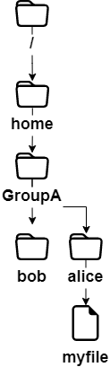
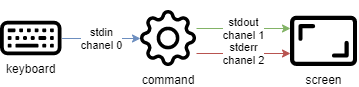
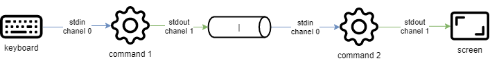

# Comandos para Usuarios Linux

En este capítulo aprenderás los comandos de Linux y cómo utilizarlos.

## Generalidades

Los sistemas Linux actuales tienen utilidades gráficas dedicadas al trabajo de un administrador. Sin embargo, es importante poder utilizar la interfaz en modo línea de comando por varios motivos:

- La mayoría de los comandos de sistema son comunes a todas las distribuciones Linux, este no es el caso de las herramientas gráficas.
- Puede ocurrir que el sistema no se inicie correctamente pero que un intérprete de comandos de respaldo permanezca accesible.
- La administración remota se ejecuta desde la línea de comando con un terminal SSH.
- Para preservar los recursos del servidor, la interfaz gráfica está instalada o se lanza bajo demanda.
- La administración es ejecutada mediante scripts.

El aprendizaje de estos comandos permite al administrador conectarse a un terminal Linux, gestionar sus recursos y archivos, identificar la estación, el terminal y los usuarios conectados, etc.

### Los usuarios

El usuario de un sistema Linux está definido en el archivo `/etc/passwd`, por:

- Un **nombre de login**, o más comúnmente llamado "login", que no puede contener espacios.
- Un identificador numérico: **UID** (User Identifier).
- Un identificador de grupo: **GID** (Group Identifier).
- Un **intérprete de comandos**, por ejemplo una shell, que puede ser diferente de un usuario a otro.
- Un **directorio de conexión**, por ejemplo el **directorio home**.

En otros archivos el usuario estará definido por:

- Una **password**, que será cifrada antes de ser almacenada (`/etc/shadow`).
- Un **prompt de comandos**, o **prompt** login, que será simbolizado por un `#` para los administradores y por un `$` para los otros usuarios (`/etc/profile`).

El comando `passwd` es un comando de sistema utilizado para modificar la contraseña del usuario actual o de otro usuario especificado. El usuario que utiliza el comando debe tener privilegios de administrador para poder modificar la contraseña de otro usuario. El comando passwd requerirá al usuario que ingrese la contraseña antigua y luego que ingrese y confirme la nueva contraseña. La contraseña ingresada no se mostrará en la pantalla por motivos de seguridad.

Dependiendo de la política de seguridad implementada en el sistema, la contraseña deberá contener un cierto número de caracteres y cumplir ciertos requisitos de complejidad.

Entre los intérpretes de comandos existentes, la **Bourne-Again Shell** (`/bin/bash`) es la más frecuentemente utilizada. Está asignada por defecto a los nuevos usuarios. Por varias razones, los usuarios avanzados de Linux pueden elegir shells alternativas entre la Korn Shell (`ksh`), la C Shell (`csh`), etc.

El directorio de acceso del usuario es por convención almacenado en el directorio `/home` de la workstation. Contendrá los datos personales del usuario y los archivos de configuración de sus aplicaciones. Por defecto, al login, el directorio de acceso es seleccionado como directorio actual.

Una instalación de tipo workstation (con interfaz gráfica) inicia esta interfaz en el terminal 1. Siendo Linux multiusuario, es posible conectar más usuarios más veces, en diferentes **terminales físicos** (TTY) o **terminales virtuales** (PTS). Los terminales virtuales están disponibles dentro de un entorno gráfico. Un usuario pasa de un terminal físico a otro usando <kbd>Alt</kbd> + <kbd>Fx</kbd> desde la línea de comando o usando <kbd>CTRL</kbd> + <kbd>Alt</kbd> + <kbd>Fx</kbd> en modo gráfico.

### La shell

Una vez que el usuario está conectado a una consola, la shell muestra el **prompt de comandos**. Se comporta entonces como un ciclo infinito, repitiendo el mismo esquema a cada instrucción ingresada:

- Muestra el prompt de comandos.
- Lectura del comando.
- Análisis de la sintaxis.
- Sustitución de caracteres especiales.
- Ejecución del comando.
- Muestra el prompt de comandos.
- etc.

La secuencia de teclas <kbd>CTRL</kbd> + <kbd>C</kbd> se usa para interrumpir un comando en ejecución.

El uso de un comando generalmente sigue esta secuencia:

```bash
comando [opción(es)] [argumento(s)]
```

El nombre del comando está a menudo en **minúsculas**.

Un espacio separa cada objeto.

Las **opciones abreviadas** comienzan con un guión (`-l`), mientras que las **opciones largas** comienzan con dos guiones (`--list`). Un doble guión (`--`) indica el fin de la lista de opciones.

Es posible agrupar algunas opciones cortas juntas:

```bash
$ ls -l -i -a
```

es equivalente a:

```bash
$ ls -lia
```

Después de una opción pueden haber más argumentos:

```bash
$ ls -lia /etc /home /var
```

En literatura, el término "opción" es equivalente al término "parámetro," que es más comúnmente usado en programación. El lado opcional de una opción o argumento es simbolizado por la inclusión entre corchetes `[` y `]`. Cuando es posible más de una opción, una barra vertical llamada "pipe" las separa `[a|e|i]`.

## Comandos generales

### comandos `apropos`, `whatis` y `man`

Es imposible para un administrador de cualquier nivel conocer todos los comandos y opciones en detalle. Usualmente está disponible un manual para todos los comandos instalados.

#### comando `apropos`

El comando `apropos` te permite buscar por palabra clave dentro de estas páginas de manuales:

| Opciones                                   | Descripción                                                                    |
| ------------------------------------------ | ------------------------------------------------------------------------------ |
| `-s`, `--sections list` o `--section list` | Limitado a las secciones de los manuales.                                      |
| `-a` o `--and`                             | Muestra solo la voz correspondiente a todas las palabras clave proporcionadas. |

Ejemplo:

```bash
$ apropos clear
clear (1)            - clear the terminal screen
clear_console (1)    - clear the console
clearenv (3)         - clear the environment
clearerr (3)         - check and reset stream status
clearerr_unlocked (3) - nonlocking stdio functions
feclearexcept (3)    - floating-point rounding and exception handling
fwup_clear_status (3) - library to support management of system firmware updates
klogctl (3)          - read and/or clear kernel message ring buffer; set console_loglevel
sgt-samegame (6)     - block-clearing puzzle
syslog (2)           - read and/or clear kernel message ring buffer; set console_loglevel
timerclear (3)       - timeval operations
XClearArea (3)       - clear area or window
XClearWindow (3)     - clear area or window
XSelectionClearEvent (3) - SelectionClear event structure
```

Para encontrar el comando que permitirá cambiar la contraseña de una cuenta:

```bash
$ apropos --exact password  -a change
chage (1)            - change user password expiry information
passwd (1)           - change user password
```

#### comando `whatis`

El comando `whatis` muestra la descripción del comando pasado como argumento:

```bash
whatis clear
```

Ejemplo:

```bash
$ whatis clear
clear (1)            - clear the terminal screen
```

#### comando `man`

Una vez encontrado con `apropos` o `whatis`, el manual es leído por `man` ("Man es tu amigo"). Este conjunto de manuales está dividido en 8 secciones, agrupando la información por tema, la sección por defecto es la 1:

1. Programas o comandos ejecutables.
2. Llamadas de sistema (funciones dadas por el kernel).
3. Llamadas de biblioteca (funciones dadas por la biblioteca).
4. Archivos especiales (usualmente se encuentran en /dev).
5. Formatos de archivos y convenciones (archivos de configuración como etc/passwd).
6. Juegos (como las aplicaciones basadas en personajes).
7. Varias (ej. man (7)).
8. Comandos de administración del sistema (usualmente solo para root).
9. Rutinas del Kernel (no estándar).

Es posible acceder a la información de cada sección escribiendo `man x intro`, donde `x` es el número de la sección.

El comando:

```bash
man passwd
```

dirá al administrador las opciones, etc, del comando passwd. Mientras que:

```bash
$ man 5 passwd
```

lo informará sobre los archivos relativos al comando.

Navegar en el manual con las flechas <kbd>↑</kbd> y <kbd>↓</kbd>. Salir del manual presionando la tecla <kbd>q</kbd>.

### comando `shutdown`

El comando `shutdown` permite **apagar electrónicamente** un servidor Linux, inmediatamente o después de un cierto período de tiempo.

```bash
shutdown [-h] [-r] time [message]
```

Especificar la hora de apagado en el formato `hh:mm` para una hora precisa, o `+mm` para un retraso en minutos.

Para forzar un apagado inmediato, usa la palabra `now` en lugar del tiempo. En este caso, el mensaje opcional no es enviado a los otros usuarios del sistema.

Ejemplos:

```bash
[root]# shutdown -h 0:30 "Server shutdown at 0:30"
[root]# shutdown -r +5
```

Opciones:

| Opciones | Observaciones                        |
| -------- | ------------------------------------ |
| `-h`     | Detiene el sistema electrónicamente. |
| `-r`     | Reinicia el sistema.                 |

### comando `history`

El comando `history` muestra el historial de comandos ingresados por el usuario.

Los comandos son almacenados en el archivo `.bash_history` en el directorio de acceso del usuario.

Ejemplo de un comando history

```bash
$ history
147 man ls
148 man history
```

| Opciones | Comentarios                                                                                |
| -------- | ------------------------------------------------------------------------------------------ |
| `-w`     | Escribe el historial actual en el archivo del historial                                    |
| `-c`     | Borra el historial de la sesión actual (pero no el contenido del archivo `.bash_history`). |

- Manipulación del historial:

Para manipular el history, los siguientes comandos ingresados desde el prompt de comandos permitirán:

| Claves             | Función                                                                                  |
| ------------------ | ---------------------------------------------------------------------------------------- |
| <kbd>!!</kbd>      | Llama al último comando ejecutado.                                                       |
| <kbd>!n</kbd>      | Llama al comando por su número en la lista.                                              |
| <kbd>!string</kbd> | Llama al comando más reciente que comienza con la cadena.                                |
| <kbd>↑</kbd>       | Navega en el historial yendo hacia atrás en el tiempo a partir del comando más reciente. |
| <kbd>↓</kbd>       | Navega en el historial yendo hacia adelante en el tiempo.                                |

### Autocompletado

El autocompletado es de gran ayuda.

- Completa los comandos, las rutas ingresadas o los nombres de los archivos.
- Una presión de la tecla <kbd>TAB</kbd> completa la voz en caso de una única solución.
- En caso de múltiples soluciones, presionar <kbd>TAB</kbd> una segunda vez para mostrar las opciones.

Si al presionar dos veces la tecla <kbd>TAB</kbd> no se presentan opciones, no hay solución para el autocompletado actual.

## Visualización e Identificación

### comando `clear`

El comando `clear` borra el contenido de la pantalla del terminal. Más precisamente, desplaza la visualización de modo que el prompt de comandos se encuentre en la parte superior de la pantalla, en la primera línea.

En un terminal físico, la pantalla será permanentemente ocultada, mientras que en una interfaz gráfica, una barra de desplazamiento permitirá volver atrás en el historial del terminal virtual.

!!! Tip "Sugerencia"

    <kbd>CTRL</kbd> + <kbd>L</kbd> tendrá el mismo efecto que el comando `clear`

### comando `echo`

El comando `echo` se usa para mostrar una cadena de caracteres.

Este comando es más comúnmente usado en los scripts administrativos para informar al usuario durante la ejecución.

La opción `-n` indica ninguna cadena de salida de nueva línea (por defecto, cadena de salida de nueva línea).

```bash
shell > echo -n "123";echo "456"
123456

shell > echo "123";echo "456"
123
456
```

Por varias razones, al desarrollador del script podría serle necesario utilizar secuencias especiales (a partir de un carácter `\`). En este caso, será usada la opción `-e`, que permitirá la interpretación de la secuencia.

Entre las secuencias usadas frecuentemente, podemos mencionar:

| Secuencia | Resultado               |
| --------- | ----------------------- |
| `\a`      | Envía un bip sonoro     |
| `\b`      | Atrás                   |
| `\n`      | Añade un salto de línea |
| `\t`      | Añade un tab horizontal |
| `\v`      | Añade un tab vertical   |

### comando `date`

El comando `date` muestra la fecha y la hora. El comando tiene la siguiente sintaxis:

```bash
date [-d yyyyMMdd] [format]
```

Ejemplos:

```bash
$ date
Mon May 24 16:46:53 CEST 2021
$ date -d 20210517 +%j
137
```

En este último ejemplo, la opción `-d` muestra una fecha determinada. La opción `+%j` formatea esta fecha para mostrar solo el día del año.

!!! Warning "Atención"

    El formato de una fecha puede cambiar según el valor del idioma definido en la variable ambiental '$LANG'.

La visualización de la fecha puede seguir los siguientes formatos:

| Opción | Formato                                                                     |
| ------ | --------------------------------------------------------------------------- |
| `+%A`  | Nombre completo del día de la semana de la localidad (por ejemplo, Domingo) |
| `+%B`  | Nombre completo del mes de la localidad (por ejemplo, Enero)                |
| `+%c`  | Fecha y hora de Local (por ejemplo, Jue Mar 3 23:05:25 2005)                |
| `+%d`  | Día del mes (ej. 01)                                                        |
| `+%F`  | Fecha en el formato `YYYY-MM-DD`                                            |
| `+%G`  | Año                                                                         |
| `+%H`  | Hora (00..23)                                                               |
| `+%j`  | Día del año (001..366)                                                      |
| `+%m`  | Número del mes (01..12)                                                     |
| `+%M`  | Minuto (00..59)                                                             |
| `+%R`  | Tiempo en el formato `hh:mm`                                                |
| `+%s`  | Segundos desde el 1° enero de 1970                                          |
| `+%S`  | Segundo (00..60)                                                            |
| `+%T`  | Tiempo en el formato `hh:mm:ss`                                             |
| `+%u`  | Día de la semana (`1` para Lunes)                                           |
| `+%V`  | Número de la semana (`+%V`)                                                 |
| `+%x`  | Fecha en el formato `DD/MM/AAAA`                                            |

El comando `date` también permite modificar la fecha y la hora del sistema. En este caso, será utilizada la opción `-s`.

```bash
[root]# date -s "2021-05-24 10:19"
```

El formato a usar usando la opción `-s` es el siguiente:

```bash
date -s "yyyy-MM-dd hh:mm[:ss]"
```

### comando `id`, `who` y `whoami`

El comando `id` se usa para mostrar información sobre usuarios y grupos. Por defecto, no se añade ningún parámetro de usuario y se muestra la información del usuario y del grupo actualmente conectados。

```bash
$ id architalia
uid=1000(architalia) gid=1000(architalia) groups=1000(architalia),10(wheel)
```

Las opciones `-g`, `-G`, `-n` y `-u` muestran el grupo principal GID, subgrupos GIDs, nombres en lugar de identificadores numéricos, y el UID del usuario.

El comando `whoami` muestra el login del usuario actual.

El solo comando `who` muestra los nombres de los usuarios conectados:

```bash
$ who
architalia tty1   2021-05-24 10:30
root     pts/0  2021-05-24 10:31
```

Dado que Linux es multiusuario, es posible que más sesiones estén abiertas en la misma estación, ya sea físicamente o a través de la red. Es interesante saber qué usuarios están conectados, si no es solo para comunicarse con ellos enviando mensajes.

- tty: representa un terminal.
- pts/: representa una consola virtual en un entorno gráfico con el número después representando la instancia de la consola virtual (0, 1, 2...)

La opción `-r` también muestra el runlevel (ver capítulo "startup").

## Árbol de Archivos

En Linux, el árbol de archivos es un árbol invertido, llamado **árbol jerárquico simple**, cuya raíz es el directorio `/`.

El **directorio actual** es el directorio donde se encuentra el usuario.

El **directorio de conexión** es el directorio de trabajo asociado al usuario. Los directorios de acceso son, por defecto, almacenados en el directorio `/home`.

Cuando el usuario accede, el directorio actual es el directorio de acceso.

Una **ruta absoluta** hace referencia a un archivo desde la raíz atravesando todo el árbol hasta el nivel del archivo:

- `/home/groupA/alice/file`

Una **ruta relativa** hace referencia al mismo archivo atravesando todo el árbol desde el directorio actual:

- `../alice/file`

En el ejemplo anterior, el "`..` " se refiere al directorio principal del directorio actual.

Un directorio, aunque esté vacío, contendrá necesariamente al menos **dos referencias**:

- `.`: referencia a sí mismo.
- `..`: referencia al directorio principal del directorio actual.

Una ruta relativa puede por lo tanto comenzar con `./` o `../`. Cuando la ruta relativa se refiere a un subdirectorio o a un archivo en el directorio actual, el `./` es frecuentemente omitido. La inclusión de la referencia `./` será realmente requerida solo para la ejecución de un archivo ejecutable.

Los errores en las rutas pueden causar muchos problemas: desde la creación de carpetas o archivos en lugares equivocados, hasta eliminaciones involuntarias, etc. Por lo tanto, es muy recomendado utilizar el autocompletado cuando se ingresan las rutas.



En el ejemplo anterior, se quiere proporcionar la posición del archivo `myfile` desde el directorio de bob.

- En una **ruta absoluta**, el directorio actual no tiene importancia. Empezamos desde la raíz y bajamos hasta los directorios `home`, `groupA`, `alice` y finalmente el archivo `myfile`: `/home/groupA/alice/myfile`.
- En una **ruta relativa**, nuestro punto de partida es el directorio actual `bob`, subimos un nivel con `..` (es decir, en el directorio `groupA`), luego bajamos al directorio de alice, y finalmente el archivo `myfile`: `../alice/myfile`.

### comando `pwd`

El comando `pwd` (Print Working Directory) muestra la ruta absoluta del directorio actual.

```bash
$ pwd
/home/architalia
```

Para utilizar una ruta relativa para hacer referencia a un archivo o a un directorio, o para usar el comando `cd` para moverse a otro directorio, es necesario conocer su posición en el árbol de archivos.

Dependiendo del tipo de shell y de los diferentes parámetros de su archivo de configuración, el prompt del terminal (también conocido como prompt de comandos) mostrará la ruta absoluta o relativa del directorio actual.

### comando `cd`

El comando `cd` (Cambiar Directorio) te permite cambiar el directorio actual -- en otras palabras, moverte a través del árbol.

```bash
$ cd /tmp
$ pwd
/tmp
$ cd ../
$ pwd
/
$ cd
$ pwd
/home/architalia
```

Como puedes ver en el último ejemplo anterior, el comando `cd` sin argumentos mueve el directorio actual al `directorio home`.

### comando `ls`

El comando `ls` muestra el contenido de un directorio.

```bash
ls [-a] [-i] [-l] [directory1] [directory2] [...]
```

Ejemplo:

```bash
$ ls /home
.    ..    architalia
```

Las opciones principales del comando `ls` son:

| Opción | Información                                                                                                                   |
| ------ | ----------------------------------------------------------------------------------------------------------------------------- |
| `-a`   | Muestra todos los archivos, incluso los ocultos. Los archivos ocultos en Linux son los que comienzan con un `.`.              |
| `-i`   | Muestra los números de inode.                                                                                                 |
| `-l`   | Utiliza un formato de lista largo, es decir, cada línea muestra información de formato largo para un archivo o un directorio. |

El comando `ls`, sin embargo, tiene muchas opciones (ver `man`):

| Opción | Información                                                                                                                                                                                             |
| ------ | ------------------------------------------------------------------------------------------------------------------------------------------------------------------------------------------------------- |
| `-d`   | Muestra la información de un directorio en lugar de listar sus contenidos.                                                                                                                              |
| `-g`   | Como la opción -l, pero no lista el propietario.                                                                                                                                                        |
| `-h`   | Muestra los tamaños de los archivos en el formato más apropiado (byte, kilobyte, megabyte, gigabyte, ...). `h` significa Human Readable. Debe ser utilizado con la opción -l.                           |
| `-s`   | Muestra el tamaño asignado de cada archivo, en bloques. En el sistema operativo GNU/Linux, "block" es la unidad de almacenamiento más pequeña en el sistema de archivos, un bloque es igual a 4096Byte. |
| `-A`   | Muestra todos los archivos en el directorio excepto `.` y `..`                                                                                                                                          |
| `-R`   | Muestra el contenido de los subdirectorios de manera recursiva.                                                                                                                                         |
| `-F`   | Muestra el tipo de archivo. Imprime un`/` para un directorio, `*` para los ejecutables, `@` para un enlace simbólico, y nada para un archivo de texto.                                                  |
| `-X`   | Ordena los archivos según sus extensiones.                                                                                                                                                              |

- Descripción de las columnas generadas por la ejecución del comando `ls -lia`:

```bash
$ ls -lia /home
78489 drwx------ 4 architalia architalia 4096 25 oct. 08:10 architalia
```

| Valor           | Información                                                                                                                                                                                                              |
| --------------- | ------------------------------------------------------------------------------------------------------------------------------------------------------------------------------------------------------------------------ |
| `78489`         | Número de inode.                                                                                                                                                                                                         |
| `drwx------`    | Tipo de archivo (`d`) y permisos (`rwx------`).                                                                                                                                                                          |
| `4`             | Número de subdirectorios. (`.` y `..` incluidas). Para un archivo, representa el número de enlaces directos y 1 representa sí mismo.                                                                                     |
| `architalia`    | Propietario del usuario.                                                                                                                                                                                                 |
| `architalia`    | Propietario del grupo.                                                                                                                                                                                                   |
| `4096`          | Para los archivos, muestra el tamaño del archivo. Para los directorios, muestra el valor fijo de 4096 bytes ocupados por el nombre del archivo. Para calcular el tamaño total de un directorio, usa `du -sh architalia/` |
| `25 oct. 08:10` | Fecha de última modificación.                                                                                                                                                                                            |
| `architalia`    | El nombre del archivo (o directorio).                                                                                                                                                                                    |

!!! Note "Nota"

    Los **Alias** ya están frecuentemente posicionados en las distribuciones comunes.

    Este es el caso del alias `ll`:

    ```
    alias ll='ls -l --color=auto'
    ```

El comando `ls` tiene muchas opciones. Aquí hay algunos ejemplos avanzados de uso:

- Lista los archivos en `/etc` según la última modificación:

```bash
$ ls -ltr /etc
total 1332
-rw-r--r--.  1 root root    662 29 may   2021 logrotate.conf
-rw-r--r--.  1 root root    272 17 may.   2021 mailcap
-rw-------.  1 root root    122 12 may.  2021 securetty
...
-rw-r--r--.  2 root root     85 18 may.  17:04 resolv.conf
-rw-r--r--.  1 root root     44 18 may.  17:04 adjtime
-rw-r--r--.  1 root root    283 18 may.  17:05 mtab
```

- Lista los archivos `/var` de tamaño superior a 1 megabyte pero inferior a 1 gigabyte. El ejemplo aquí presentado utiliza los comandos avanzados `grep` con expresiones regulares. Los novatos no deben luchar demasiado, habrá un tutorial especial para introducir estas expresiones regulares en el futuro.

```bash
$ ls -lhR /var/ | grep ^\- | grep -E "[1-9]*\.[0-9]*M"
...
-rw-r--r--. 1 apache apache 1.2M 10 may.  13:02 XB RiyazBdIt.ttf
-rw-r--r--. 1 apache apache 1.2M 10 may.  13:02 XB RiyazBd.ttf
-rw-r--r--. 1 apache apache 1.1M 10 may.  13:02 XB RiyazIt.ttf
...
```

Por supuesto, se recomienda fuertemente utilizar el comando `find`.

```bash
$ find /var -size +1M -a -size -1024M -a -type f -exec ls -lh {} \;
```

- Muestra los permisos de una carpeta:

Para conocer los permisos de una carpeta, por ejemplo `/etc`, el siguiente comando **no** sería apropiado:

```bash
$ ls -l /etc
total 1332
-rw-r--r--.  1 root root     44 18 nov.  17:04 adjtime
-rw-r--r--.  1 root root   1512 12 janv.  2010 aliases
-rw-r--r--.  1 root root  12288 17 nov.  17:41 aliases.db
drwxr-xr-x.  2 root root   4096 17 nov.  17:48 alternatives
...
```

El comando anterior mostrará el contenido de la carpeta (dentro) por defecto. Para la carpeta misma, es posible utilizar la opción `-d`.

```bash
$ ls -ld /etc
drwxr-xr-x. 69 root root 4096 18 nov.  17:05 /etc
```

- Ordenar por tamaño del archivo, primero el más grande:

```bash
$ ls -lhS
```

- Formato hora/fecha con `-l`:

```bash
$ ls -l --time-style="+%Y-%m-%d %m-%d %H:%M" /
total 12378
dr-xr-xr-x. 2 root root 4096 2014-11-23 11-23 03:13 bin
dr-xr-xr-x. 5 root root 1024 2014-11-23 11-23 05:29 boot
```

- Añadir la barra _trailing slash_ al final de las carpetas:

Por defecto, el comando `ls` no muestra la última barra de una carpeta. En algunos casos, como para los scripts, por ejemplo, es útil mostrarla:

```bash
$ ls -dF /etc
/etc/
```

- Ocultar algunas extensiones:

```bash
$ ls /etc --hide=*.conf
```

### comando `mkdir`

El comando `mkdir` crea un directorio o un árbol de directorios.

```bash
mkdir [-p] directory [directory] [...]
```

Ejemplo:

```bash
$ mkdir /home/architalia/work
```

El directorio "architalia" debe estar presente para crear el directorio "work".

De lo contrario, se debe usar la opción `-p`. La opción `-p` crea los directorios padre si estos no existen.

!!! Danger "Peligro"

    No es recomendable usar los nombres de los comandos Linux como directorios o nombres de archivos.

### comando `touch`

El comando `touch` modifica la marca de tiempo de un archivo o crea un archivo vacío si el archivo no existe.

```bash
touch [-t date] file
```

Ejemplo:

```bash
$ touch /home/architalia/myfile
```

| Opción    | Información                                                                   |
| --------- | ----------------------------------------------------------------------------- |
| `-t date` | Cambia la fecha de última modificación del archivo con la fecha especificada. |

Formato de fecha: `[AAAA]MMJJhhmm[ss]`

!!! Tip "Suggerimento"

    El comando `touch` es usado principalmente para crear un archivo vacío, pero puede ser útil, por ejemplo, para los backups incrementales o diferenciales. De hecho, el único efecto de ejecutar un `touch` sobre un archivo será forzar su guardado durante el backup siguiente.

### comando `rmdir`

El comando `rmdir` elimina un directorio vacío.

Ejemplo:

```bash
$ rmdir /home/architalia/work
```

| Opción | Información                                                              |
| ------ | ------------------------------------------------------------------------ |
| `-p`   | Elimina la carpeta padre o las carpetas proporcionadas, si están vacías. |

!!! Tip "Sugerimiento"

    Para eliminar una carpeta no vacía y su contenido, utiliza el comando `rm`.

### comando `rm`

El comando `rm` elimina un archivo o un directorio.

```bash
rm [-f] [-r] file [file] [...]
```

!!! Danger "Peligro"

    Cualquier eliminación de un archivo o directorio es definitiva.

| Opciones | Información                                                 |
| -------- | ----------------------------------------------------------- |
| `-f`     | No preguntar si eliminar.                                   |
| `-i`     | Preguntar si cancelar.                                      |
| `-r`     | Elimina una carpeta y borra recursivamente sus subcarpetas. |

!!! Note "Nota"

    El comando `rm` no pide confirmación cuando se eliminan los archivos. Sin embargo, con una distribución arch/arch, `rm` pide confirmación de borrado porque el comando `rm` es un `alias` del comando `rm -i`. No te sorprendas si en otra distribución, como Debian, por ejemplo, no obtienes una solicitud de confirmación.

La eliminación de una carpeta con el comando `rm`, ya sea que la carpeta esté vacía o no, requiere añadir la opción `-r`.

El fin de las opciones es señalado a la shell por un doble guión `--`.

En el ejemplo:

```bash
$ >-hard-hard # To create an empty file called -hard-hard
hard-hard
[CTRL+C] To interrupt the creation of the file
$ rm -f -- -hard-hard
```

El nombre del archivo hard-hard comienza con un `-`. Sin el uso del `--` la shell habría interpretado el `-d` en `-hard-hard` como una opción.

### command `mv`

El comando `mv` mueve y renombra un archivo.

```bash
mv file [file ...] destination
```

Ejemplos:

```bash
$ mv /home/architalia/file1 /home/architalia/file2
$ mv /home/architalia/file1 /home/architalia/file2 /tmp
```

| Opciones | Información                                                                   |
| -------- | ----------------------------------------------------------------------------- |
| `-f`     | No pedir confirmación para sobrescribir el archivo de destino.                |
| `-i`     | Solicitar confirmación para sobrescribir el archivo de destino (por defecto). |

Algunos casos concretos te ayudará a entender las dificultades que pueden surgir:

```bash
$ mv /home/architalia/file1 /home/architalia/file2
```

Renomba `file1` a `file2`. Si `file2` ya existe, reemplaza el contenido del archivo con `file1`.

```bash
$ mv /home/architalia/file1 /home/architalia/file2 /tmp
```

Mueve `file1` y `file2` a la carpeta `/tmp`.

```bash
$ mv file1 /repexist/file2
```

Mueve `file1` a `repexist` y lo renombra `file2`.

```bash
$ mv file1 file2
```

`file1` es renombrado a `file2`.

```bash
$ mv file1 /repexist
```

Si existe la carpeta de destino, `file1` es movido a `/repexist`.

```bash
$ mv file1 /wrongrep
```

Si el directorio de destino no existe, `file1` es renombrado a `wrongrep` en el directorio principal.

### comando `cp`

El comando `cp` copia un archivo.

```bash
cp file [file ...] destination
```

Ejemplo:

```bash
$ cp -r /home/architalia /tmp
```

| Opciones | Información                                                                     |
| -------- | ------------------------------------------------------------------------------- |
| `-i`     | Solicitud de confirmación para sobrescribir (por defecto).                      |
| `-f`     | No pedir confirmación para sobrescribir el archivo de destino.                  |
| `-p`     | Mantiene el propietario, los permisos y la marca de tiempo del archivo copiado. |
| `-r`     | Copia un directorio con sus archivos y subdirectorios.                          |
| `-s`     | Crea un enlace simbólico en lugar de copiar.                                    |

```bash
cp file1 /repexist/file2
```

`file1` es copiado a `/repexist` con el nombre `file2`.

```bash
$ cp file1 file2
```

`file1` es copiado como `file2` en esta carpeta.

```bash
$ cp file1 /repexist
```

Si existe el directorio de destino, `file1` es copiado a `/repexist`.

```bash
$ cp file1 /wrongrep
```

Si el directorio de destino no existe, `file1` es copiado bajo el nombre `wrongrep` en el directorio principal.

## Visualización

### comando `file`

El comando `file` muestra el tipo de un archivo.

```bash
file file1 [files]
```

Ejemplo:

```bash
$ file /etc/passwd /etc
/etc/passwd:    ASCII text
/etc:        directory
```

### comando `more`

El comando `more` muestra el contenido de uno o más archivos pantalla por pantalla.

```bash
more file1 [files]
```

Ejemplo:

```bash
$ more /etc/passwd
root:x:0:0:root:/root:/bin/bash
...
```

Usando la tecla <kbd>ENTER</kbd>, el desplazamiento es línea por línea. Usando la tecla <kbd>SPACE</kbd>, el desplazamiento es página por página. `/text` te permite buscar la coincidencia en el archivo.

### comando `less`

El comando `less` muestra el contenido de uno o más archivos. El comando `less` es interactivo y tiene sus propios comandos para el uso.

```bash
less file1 [files]
```

Los comandos específicos para `less` son:

| Comando                                          | Acción                                                          |
| ------------------------------------------------ | --------------------------------------------------------------- |
| <kbd>h</kbd>                                     | Ayuda.                                                          |
| <kbd>↑</kbd><kbd>↓</kbd><kbd>→</kbd><kbd>←</kbd> | Moverse arriba, abajo de una línea, o a la derecha e izquierda. |
| <kbd>Intro</kbd>                                 | Moverse abajo de una línea.                                     |
| <kbd>Espacio</kbd>                               | Moverse abajo de una página.                                    |
| <kbd>AvPág</kbd> y <kbd>RePág</kbd>              | Moverse arriba o abajo de una página.                           |
| <kbd>gg</kbd> y <kbd>G</kbd>                     | Pasar a la primera y última página                              |
| `/text`                                          | Buscar el texto.                                                |
| <kbd>q</kbd>                                     | Cerrar el comando`less`.                                        |

### comando `cat`

El comando `cat` concatena el contenido de varios archivos y muestra el resultado en la salida estándar.

```bash
cat file1 [files]
```

Ejemplo 1 - Visualización del contenido de un archivo en salida estándar:

```bash
$ cat /etc/passwd
```

Ejemplo 2 - Visualización del contenido de varios archivos en salida estándar:

```bash
$ cat /etc/passwd /etc/group
```

Ejemplo 3 - Combinar el contenido de varios archivos en un único archivo utilizando la redirección de la salida:

```bash
$ cat /etc/passwd /etc/group > usersAndGroups.txt
```

Ejemplo 4 - Visualización de la numeración de línea:

```bash
$ cat -n /etc/profile
     1    # /etc/profile: system-wide .profile file for the Bourne shell (sh(1))
     2    # and Bourne compatible shells (bash(1), ksh(1), ash(1), ...).
     3
     4    if [ "`id -u`" -eq 0 ]; then
     5      PATH="/usr/local/sbin:/usr/local/bin:/usr/sbin:/usr/bin:/sbin:/bin"
     6    else
    …
```

Ejemplo 5 - Muestra la numeración de las líneas no vacías:

```bash
$ cat -b /etc/profile
     1    # /etc/profile: system-wide .profile file for the Bourne shell (sh(1))
     2    # and Bourne compatible shells (bash(1), ksh(1), ash(1), ...).

     3    if [ "`id -u`" -eq 0 ]; then
     4      PATH="/usr/local/sbin:/usr/local/bin:/usr/sbin:/usr/bin:/sbin:/bin"
     5    else
    …
```

### comando `tac`

El comando `tac` hace casi lo contrario del comando `cat`. Muestra el contenido de un archivo a partir del final (¡que es particularmente interesante para la lectura de los logs!).

Ejemplo: Muestra un archivo de log mostrando primero la última línea:

```bash
[root]# tac /var/log/messages | less
```

### comando `head`

El comando `head` muestra el inicio de un archivo.

```bash
head [-n x] file
```

| Opción | Descripción                                 |
| ------ | ------------------------------------------- |
| `-n x` | Mostrar las primeras `x` líneas del archivo |

Por defecto (sin la opción `-n`), el comando `head` mostrará las primeras 10 líneas del archivo.

### comando `tail`

El comando `tail` muestra el final de un archivo.

```bash
tail [-f] [-n x] file
```

| Opción | Descripción                                          |
| ------ | ---------------------------------------------------- |
| `-n x` | Mostrar las últimas `x` líneas del archivo           |
| `-f`   | Mostrar las modificaciones al archivo en tiempo real |

Ejemplo:

```bash
tail -n 3 /etc/passwd
sshd:x:74:74:Privilege-separeted sshd:/var/empty /sshd:/sbin/nologin
tcpdump::x:72:72::/:/sbin/nologin
user1:x:500:500:grp1:/home/user1:/bin/bash
```

Con la opción `-f`, la información de modificación del archivo siempre será emitida a menos que el usuario salga del estado de monitorización con <kbd>CTRL</kbd> + <kbd>C</kbd>. Esta opción es muy utilizada para rastrear los archivos de log (los registros) en tiempo real.

Sin la opción `-n`, el comando `tail` muestra las últimas 10 líneas del archivo.

### comando `sort`

El comando `sort` ordena las líneas de un archivo.

Permite ordenar el resultado de un comando o el contenido de un archivo en un orden determinado, numérico, alfabético, por tamaño (KB, MB, GB) o en orden inverso.

```bash
sort [-k] [-n] [-u] [-o file] [-t] file
```

Ejemplo:

```bash
$ sort -k 3,4 -t ":" -n /etc/passwd
root:x:0:0:root:/root:/bin/bash
adm:x:3:4:adm:/var/adm/:/sbin/nologin
```

| Opción    | Descripción                                                                                                                                                                                          |
| --------- | ---------------------------------------------------------------------------------------------------------------------------------------------------------------------------------------------------- | ------ |
| `-k`      | Especifica las columnas a separar. Es posible especificar más columnas.                                                                                                                              |
| `-n`      | Requiere una ordenación numérica.                                                                                                                                                                    |
| `-o file` | Guarda la ordenación en el archivo especificado.                                                                                                                                                     |
| `-t`      | Especificar un delimitador, que requiere que los contenidos del archivo correspondiente sean contenidos de columnas regularmente delimitadas, de lo contrario no pueden ser ordenados correctamente. |
| `-r`      | Invierte el orden del resultado. Usado junto con la opción `-n` para ordenar del más grande al más pequeño.                                                                                          |
| `-u`      | Elimina los duplicados después de la ordenación. Equivalente a `sort file                                                                                                                            | uniq`. |

El comando `sort` solo ordena el archivo en la pantalla. El archivo no es modificado por la ordenación. Para guardar la ordenación, usar la opción `-o` o una redirección de la salida `>`.

Por defecto, los números son ordenados según su carácter. Por lo tanto, "110" estará antes de "20", que a su vez estará antes de "3". La opción `-n` debe especificarse para que los bloques de caracteres numéricos sean ordenados según su valor.

El comando `sort` invierte el orden de los resultados, con la opción `-r`:

```bash
$ sort -k 3 -t ":" -n -r /etc/passwd
nobody:x:65534:65534:Kernel Overflow User:/:/sbin/nologin
systemd-coredump:x:999:997:systemd Core Dumper:/:/sbin/nologin
polkitd:x:998:996:User for polkitd:/:/sbin/nologin
```

En este ejemplo, el comando `sort` ordenará el contenido del archivo `/etc/passwd` desde el uid (identificador de usuario) más grande al más pequeño.

Algunos ejemplos avanzados de utilización del comando `sort`:

- Mezclando los valores

El comando `sort` también permite mezclar los valores con la opción `-R`:

```bash
$ sort -R /etc/passwd
```

- Ordenación de direcciones IP

Un administrador de sistema se encuentra rápidamente frente al procesamiento de direcciones IP de los logs de sus servicios, como SMTP, VSFTP o Apache. Estas direcciones son típicamente extraídas con el comando `cut`.

He aquí un ejemplo con el archivo `dns-client.txt`:

```
192.168.1.10
192.168.1.200
5.1.150.146
208.128.150.98
208.128.150.99
```

```bash
$ sort -nr dns-client.txt
208.128.150.99
208.128.150.98
192.168.1.200
192.168.1.10
5.1.150.146
```

- Ordenación de archivos mediante la eliminación de duplicados

El comando `sort` sabe cómo eliminar los duplicados de la salida del archivo usando la opción `-u`.

He aquí un ejemplo con el archivo `colours.txt`:

```
Red
Green
Blue
Red
Pink
```

```
$ sort -u colours.txt
Blue
Green
Pink
Red
```

- Ordenación de archivos según las dimensiones

El comando `sort` sabe cómo reconocer las dimensiones de los archivos, de comandos como `ls` con la opción `-h`.

He aquí un ejemplo con el archivo `size.txt`:

```
1.7G
18M
69K
2.4M
1.2M
4.2G
6M
124M
12.4M
4G
```

```bash
$ sort -hr size.txt
4.2G
4G
1.7G
124M
18M
12.4M
6M
2.4M
1.2M
69K
```

### comando `wc`

El comando `wc` cuenta el número de líneas, palabras y/o bytes de un archivo.

```bash
wc [-l] [-m] [-w] file [files]
```

| Opción | Descripción                     |
| ------ | ------------------------------- |
| `-c`   | Cuenta el número de bytes.      |
| `-m`   | Cuenta el número de caracteres. |
| `-l`   | Cuenta el número de líneas.     |
| `-w`   | Cuenta el número de palabras.   |

## Búsqueda

### comando `find`

El comando `find` busca la posición de archivos o carpetas.

```bash
find directory [-name name] [-type type] [-user login] [-date date]
```

Dado que las opciones del comando `find` son numerosas, es mejor referirse al comando `man`.

Si la carpeta de búsqueda no es especificada, el comando `find` realizará la búsqueda desde la carpeta actual.

| Opción              | Descripción                                 |
| ------------------- | ------------------------------------------- |
| `-perm permissions` | Busca los archivos según sus permisos.      |
| `-size size`        | Búsqueda de archivos según las dimensiones. |

### opción `-exec` del comando `find`

Es posible utilizar la opción `-exec` del comando `find` para ejecutar un comando en cada línea del resultado:

```bash
$ find /tmp -name *.txt -exec rm -f {} \;
```

El comando anterior busca todos los archivos en la carpeta `/tmp` denominados `*.txt` y los elimina.

!!! Tip "Comprender la opción `-exec`"

    En el ejemplo anterior, el comando `find` construirá una cadena que representa el comando a ejecutar.

    Si el comando `find` encuentra tres archivos llamados `log1.txt`, `log2.txt` y `log3.txt`, entonces el comando `find` construirá la cadena reemplazando los paréntesis en la cadena `rm -f {} \;` con uno de los resultados de la búsqueda, y lo hará tantas veces como resultados haya.

    Esto nos dará:

    ```
    rm -f /tmp/log1.txt ; rm -f /tmp/log2.txt ; rm -f /tmp/log3.txt ;
    ```

    El carácter `;` es un carácter especial de la shell que debe ser protegido por `\` para evitar que sea interpretado demasiado pronto por el comando `find` (y no en el `-exec`).

!!! Tip "Sugerimiento"

    `$ find /tmp -name *.txt -delete` hace lo mismo.

### comando `whereis`

El comando `whereis` busca los archivos relativos a un comando.

```bash
whereis [-b] [-m] [-s] command
```

Ejemplo:

```bash
$ whereis -b ls
ls: /bin/ls
```

| Opción | Descripción                                   |
| ------ | --------------------------------------------- |
| `-b`   | Ejecuta la búsqueda solo del archivo binario. |
| `-m`   | Busca solo en las páginas man.                |
| `-s`   | Busca solo en archivos fuente.                |

### command `grep`

El comando `grep` busca una cadena en un archivo.

```bash
grep [-w] [-i] [-v] "string" file
```

Ejemplo:

```bash
$ grep -w "root:" /etc/passwd
root:x:0:0:root:/root:/bin/bash
```

| Opción | Descripción                                 |
| ------ | ------------------------------------------- |
| `-i`   | Ignora las mayúsculas de la cadena buscada. |
| `-v`   | Excluye las líneas que contienen la cadena. |
| `-w`   | Busca la palabra exacta.                    |

El comando `grep` devuelve la línea completa que contiene la cadena buscada.

- El carácter especial `^` se usa para buscar una cadena al inicio de una línea.
- El carácter especial `$` se usa para buscar una cadena al final de una línea.

```bash
$ grep -w "^root" /etc/passwd
```

!!! Note "Nota"

    Este comando es muy potente y se recomienda fuertemente consultar su manual. Tiene numerosos derivados.

Es posible buscar una cadena en un árbol de archivos con la opción `-R`.

```bash
grep -R "Virtual" /etc/httpd
```

### Meta-caracteres (wildcards)

Los meta-caracteres sustituyen uno o más caracteres (o incluso una ausencia de caracteres) durante una búsqueda. Estos meta-caracteres también son conocidos como wildcards.

Pueden ser combinados.

El carácter `*` sustituye una cadena compuesta por cualquier carácter. El carácter `*` también puede representar una ausencia de caracteres.

```bash
$ find /home -name "test*"
/home/architalia/test
/home/architalia/test1
/home/architalia/test11
/home/architalia/tests
/home/architalia/test362
```

Los meta-caracteres permiten búsquedas más complejas sustituyendo todo o parte de una palabra. Simplemente sustituyen las incógnitas con estos caracteres especiales.

El carácter `?` sustituye un solo carácter, cualquiera que sea.

```bash
$ find /home -name "test?"
/home/architalia/test1
/home/architalia/tests
```

Los corchetes `[` y `]` se usan para especificar los valores que un solo carácter puede tomar.

```bash
$ find /home -name "test[123]*"
/home/architalia/test1
/home/architalia/test11
/home/architalia/test362
```

!!! Note "Nota"

    Siempre rodear las palabras que contienen metacaracteres con `"` para evitar que sean sustituidas por los nombres de archivos que cumplen los criterios.

!!! Warning "Atención"

    No confundas los meta-caracteres de la shell con los meta-caracteres de las expresiones regulares. El comando `grep` utiliza meta-caracteres de expresiones regulares.

## Redirecciones y pipes

### Entrada y salida estándar

En los sistemas UNIX y Linux, hay tres flujos estándar. Permiten a los programas, a través de la biblioteca `stdio.h`, enviar y recibir información.

Estos flujos son llamados canal X o descriptor de archivo X.

Por defecto:

- el teclado es el dispositivo de entrada para el canal 0, llamado **stdin** ;
- la pantalla es el dispositivo de salida para los canales 1 y 2, llamados **stdout** y **stderr**.



**stderr** recibe los flujos de error devueltos por un comando. Los otros flujos son dirigidos a **stdout**.

Estos flujos apuntan a archivos de dispositivos, pero ya que todo es un archivo en UNIX/Linux, los flujos de E/S pueden ser fácilmente direccionados a otros archivos. Este principio es la fuerza de la shell.

### Redirección de Entrada

Es posible redirigir el flujo de entrada desde otro archivo con el carácter `<` o `<<`. El comando leerá el archivo en lugar del teclado:

```bash
$ ftp -in serverftp << ftp-commands.txt
```

!!! Note "Nota"

    Solo los comandos que requieren la entrada del teclado serán capaces de manejar la redirección de la entrada.

La redirección de entrada también puede ser usada para simular la interactividad del usuario. El comando leerá el flujo de entrada hasta que encuentre la palabra clave definida después de la redirección de entrada.

Esta función es usada para los comandos interactivos en los scripts:

```bash
$ ftp -in serverftp << END
user alice password
put file
bye
END
```

La palabra clave `END` puede ser reemplazada por cualquier palabra.

```bash
$ ftp -in serverftp << STOP
user alice password
put file
bye
STOP
```

La shell sale del comando `ftp` cuando recibe una línea que contiene solo la palabra clave.

!!! Warning "Atención"

    La palabra clave final, aquí `END` o `STOP`, debe ser la única palabra en la línea y debe estar al inicio de la línea.

La redirección del estándar input es usada raramente, porque la mayoría de los comandos aceptan un nombre de archivo como argumento.

El comando `wc` podría ser usado de esta manera:

```bash
$ wc -l .bash_profile
27 .bash_profile # the number of lines is followed by the file name
$ wc -l < .bash_profile
27 # returns only the number of lines
```

### Redirección de Salida

La salida estándar puede ser redirigida a otros archivos usando el carácter `>` o `>>`.

La simple redirección `>` sobrescribe el contenido del archivo de salida:

```bash
$ date +%F > date_file
```

Cuando se usa el carácter `>>`, indica que el resultado del comando es añadido al contenido del archivo.

```bash
$ date +%F >> date_file
```

En ambos casos, el archivo es creado automáticamente cuando no existe.

La salida de error estándar también puede ser redirigida a otro archivo. Esta vez será necesario especificar el número del canal (que puede ser omitido para los canales 0 y 1):

```bash
$ ls -R / 2> errors_file
$ ls -R / 2>> errors_file
```

### Ejemplos de redirección

Redirección de 2 salidas a 2 archivos:

```bash
$ ls -R / >> ok_file 2>> nok_file
```

Redirección de 2 salidas a un solo archivo:

```bash
$ ls -R / >> log_file 2>&1
```

Redirección del _stderr_ a un "pozo sin fondo" (`/dev/null`):

```bash
$ ls -R / 2>> /dev/null
```

Cuando ambos flujos de salida son redirigidos, ninguna información es mostrada en la pantalla. Para usar tanto la redirección de salida como mantener la visualización, es necesario usar el comando `tee`.

### Pipes

Un **pipe** es un mecanismo que permite conectar la salida estándar de un primer comando a la entrada estándar de un segundo comando.

Esta comunicación es unidireccional y se hace con el símbolo `|`. El símbolo del pipe `|` se obtiene presionando la tecla <kbd>SHIFT</kbd> + <kbd>|</kbd> simultáneamente.



Todos los datos enviados por el control a la izquierda del pipe a través del canal de salida estándar son enviados al canal de entrada estándar del control a la derecha.

Los comandos particularmente utilizados después de un pipe son los filtros.

- Ejemplos:

Muestra solo el inicio:

```bash
$ ls -lia / | head
```

Muestra solo el final:

```bash
$ ls -lia / | tail
```

Ordena el resultado:

```bash
$ ls -lia / | sort
```

Cuenta el número de palabras / caracteres:

```bash
$ ls -lia / | wc
```

Busca una cadena en el resultado:

```bash
$ ls -lia / | grep fichier
```

## Puntos Especiales

### comando `tee`

El comando `tee` se usa para redirigir la salida estándar de un comando a un archivo manteniendo la visualización en la pantalla.

Se combina con el pipe `|` para recibir como entrada la salida del comando a redirigir:

```bash
$ ls -lia / | tee fic
$ cat fic
```

La opción `-a` añade al archivo en lugar de sobrescribirlo.

### comandos `alias` y `unalias`

El uso de **alias** es una forma de pedir a la shell que recuerde un comando particular con sus opciones y que le dé un nombre.

Por ejemplo:

```bash
$ ll
```

sustituirá al comando:

```bash
$ ls -l
```

El comando `alias` lista los alias para la sesión actual. Los alias están establecidos por defecto en las distribuciones Linux. Aquí, los alias para un servidor arch Linux:

```bash
$ alias
alias l.='ls -d .* --color=auto'
alias ll='ls -l --color=auto'
alias ls='ls --color=auto'
alias vi='vim'
alias which='alias | /usr/bin/which --tty-only --read-alias --show-dot --show-tilde'
```

Los alias están definidos solo temporalmente, por el tiempo de la sesión de usuario.

Para un uso permanente, deben ser creados en:

- archivo `.bashrc` en el directorio de acceso del usuario;
- archivo `/etc/bashrc` para todos los usuarios.

!!! Warning "Atención"

    ¡Debe prestarse especial atención al usar alias que pueden ser potencialmente peligrosos! Por ejemplo, un alias creado sin un conocimiento básico de administrador:

    ```bash
    alias cd='rm -Rf'
    ```

El comando `unalias` te permite eliminar los alias.

Para eliminar un solo alias:

```bash
$ unalias ll
```

Para eliminar todos los alias:

```bash
$ unalias -a
```

Para deshabilitar temporalmente un alias, la combinación es `\<nombre alias>`.

Por ejemplo si escribimos:

```bash
$ type ls
```

podría devolver lo siguiente:

```bash
ls is an alias to « ls -rt »
```

Ahora que esto es conocido, podemos ver los resultados de usar el alias o deshabilitarlo de una vez con el carácter `\` ejecutando lo siguiente:

```bash
$ ls file*   # order by time
file3.txt  file2.txt  file1.txt
$ \ls file*  # order by name
file1.txt  file2.txt  file3.txt
```

### Alias y Funciones Útiles

- alias de `grep`.

Colorea el resultado del comando `grep`: `alias grep='grep --color=auto'`

- función `mcd`

Es común crear una carpeta y luego moverse dentro de ella: `mcd() { mkdir -p "$1"; cd "$1"; }`

- función `cls`

Moverse a una carpeta y listar su contenido: `cls() { cd "$1"; ls; }`

- función `backup`

Crea una copia de seguridad de un archivo: `backup() { cp "$1"{,.bak}; }`

- función `extract`

Extrae cualquier tipo de archivo:

```bash
extract () {
  if [ -f $1 ] ; then
    case $1 in
      *.tar.bz2) tar xjf $1 ;;
      *.tar.gz) tar xzf $1 ;;
      *.bz2) bunzip2 $1 ;;
      *.rar) unrar e $1 ;;
      *.gz) gunzip $1 ;;
      *.tar) tar xf $1 ;;
      *.tbz2) tar xjf $1 ;;
      *.tgz) tar xzf $1 ;;
      *.zip) unzip $1 ;;
      *.Z) uncompress $1 ;;
      *.7z) 7z x $1 ;;
      *)
        echo "'$1' cannot be extracted via extract()" ;;
    esac
  else
    echo "'$1' is not a valid file"
  fi
}

```

- Si el `alias cmount` devuelve lo siguiente: `alias cmount="mount | column -t"`

Entonces se puede usar `cmount` para mostrar todos los mounts del sistema en columnas como la siguiente: `[root]# cmount`

que devuelve nuestro sistema de archivos montado en el siguiente formato:

```bash
/dev/simfs  on  /                                          type  simfs        (rw,relatime,usrquota,grpquota)
proc        on  /proc                                      type  proc         (rw,relatime)
sysfs       on  /sys                                       type  sysfs        (rw,relatime)
none        on  /dev                                       type  devtmpfs     (rw,relatime,mode=755)
none        on  /dev/pts                                   type  devpts       (rw,relatime,mode=600,ptmxmode=000)
none        on  /dev/shm                                   type  tmpfs        (rw,relatime)
none        on  /proc/sys/fs/binfmt_misc                   type  binfmt_misc  (rw,relatime)
```

### El carácter `;`

El carácter `;` concatena los comandos.

Una vez que el usuario ha presionado <kbd>ENTER</kbd>, todos los comandos serán ejecutados en secuencia en el orden de ingreso.

<pre><code class="bash">$ ls /; cd /home; ls -lia; cd /
</code></pre>

<h2 spaces-before="0">
  Verificar tus Conocimientos
</h2>

<p spaces-before="0">
  :heavy_check_mark: ¿Qué define un usuario en Linux? (7 respuestas)
</p>

<p spaces-before="0">
  :heavy_check_mark: ¿Qué caracteriza una opción larga para un comando?
</p>

<p spaces-before="0">
  :heavy_check_mark: ¿Qué comandos te permiten buscar ayuda sobre un comando?
</p>

<ul>
  <li>
    [ ] <code>google</code>
  </li>
  <li>
    [ ] <code>chuck --norris</code>
  </li>
  <li>
    [ ] <code>info</code>
  </li>
  <li>
    [ ] <code>apropos</code>
  </li>
  <li>
    [ ] <code>whatis</code>
  </li>
</ul>

<p spaces-before="0">
  :heavy_check_mark: ¿Qué comando te permite ver el historial de un usuario?
</p>

<p spaces-before="0">
  :heavy_check_mark: ¿Qué comando te permite buscar texto en un archivo?
</p>

<ul>
  <li>
    [ ] <code>find</code>
  </li>
  <li>
    [ ] <code>grep</code>
  </li>
</ul>

<p spaces-before="0">
  :heavy_check_mark: ¿Qué comando te permite buscar un archivo?
</p>

<ul>
  <li>
    [ ] <code>find</code>
  </li>
  <li>
    [ ] <code>grep</code>
  </li>
</ul>

<p spaces-before="0">
  :heavy_check_mark: ¿Qué comando redirige el flujo de error de un comando a un nuevo archivo <code>errors.log</code>?
</p>

<ul>
  <li>
    [ ] <code>ls -R / 2&gt; errors.log</code>
  </li>
  <li>
    [ ] <code>ls -R / 2&gt;&gt; errors.log</code>
  </li>
  <li>
    [ ] <code>ls -R / 2&gt; errors.log 2&gt;&1</code>
  </li>
</ul>
