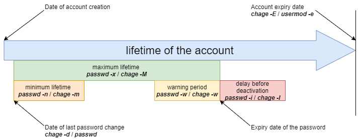

# User Management

In this chapter, you will learn how to manage users.

## General

Each user must have a group, which is called the user's **primary group**.

Multiple users can belong to the same group.

Groups other than the primary group are called **supplementary groups**.

!!! Note "Note"

    Each user has a primary group and can be invited into one or more supplementary groups.

Groups and users are managed by their unique numerical identifiers `GID` and `UID`.

* `UID`: _User IDentifier_. Unique user ID.
* `GID`: _Group IDentifier_. Unique group identifier.

Both UID and GID are recognized by the kernel, which means the Super Admin is not necessarily the **root** user, as long as the **uid=0** user is the Super Admin.

The user/group files are:

* /etc/passwd
* /etc/shadow
* /etc/group
* /etc/gshadow
* /etc/skel/
* /etc/default/useradd
* /etc/login.defs

!!! Danger "Danger"

    You should always use administration commands instead of manually editing files.

## Group Management

Modified files, added lines:

* `/etc/group`
* `/etc/gshadow`

### `groupadd` command

The `groupadd` command adds a group to the system.
```
groupadd [-g GID] group
```

Example:

```
$ sudo groupadd -g 1012 GroupB
```

| Option  | Description                                                                                                                        |
| -------- | ---------------------------------------------------------------------------------------------------------------------------------- |
| `-g GID` | Defines the `GID` of the group to be created.                                                                                           |
| `-f`     | The system chooses a `GID` if the one specified with `-g` option already exists.                                                     |
| `-r`     | Creates a system group with a `GID` between `SYS_GID_MIN` and `SYS_GID_MAX`. These two variables are defined in `/etc/login.defs`. |

Group naming rules:

* No accents or special characters;
* Different from the name of an existing user or system file.

!!! Note "Note"

    Under **Debian**, the administrator should use, except in scripts intended to be portable across all Linux distributions, the `addgroup` and `delgroup` commands as specified in `man`:

    ```
    $ man addgroup
    DESCRIPTION
    adduser and addgroup add users and groups to the system according to command line options and configuration information
    in /etc/adduser.conf. They are friendlier front ends to the low-level tools like useradd, groupadd and usermod programs,
    by default, choosing Debian policy conformant UID and GID values, creating a home directory with skeletal configuration,
    running a custom script, and other features.
    ```

### `groupmod` command

The `groupmod` command allows you to modify an existing group on the system.

```
groupmod [-g GID] [-n name] group
```

Example:

```
$ sudo groupmod -g 1016 GroupP
$ sudo groupmod -n GroupC GroupB
```

| Option   | Observations                          |
| --------- | ------------------------------------- |
| `-g GID` | New `GID` of the group to modify. |
| `-n name` | New name.                           |

You can change a group's name, its `GID`, or both simultaneously.

After modification, files belonging to the group have an unknown `GID`. They must be reassigned to the new `GID`.

```
$ sudo find / -gid 1002 -exec chgrp 1016 {} \;
```

### `groupdel` command

The `groupdel` command is used to delete an existing group on the system.

```
groupdel group
```

Example:

```
$ sudo groupdel GroupC
```

!!! Tip "Tip"

    When deleting a group, two conditions can occur:

    * If a user has a unique primary group and you run the `groupdel` command on that group, it will indicate that there is a specific user under the group and that it cannot be deleted.
    * If a user belongs to a supplementary group (not the user's primary group) and that group is not the primary group of another user on the system, the `groupdel` command will delete the group without further prompts.

    Examples:

    ```bash
    Shell > useradd testa
    Shell > id testa
    uid=1000(testa) gid=1000(testa) group=1000(testa)
    Shell > groupdel testa
    groupdel: cannot remove the primary group of user 'testa'

    Shell > groupadd -g 1001 testb
    Shell > usermod -G testb root
    Shell > id root
    uid=0(root) gid=0(root) group=0(root),1001(testb)
    Shell > groupdel testb
    ```

!!! Tip "Tip"

    When deleting a user with the `userdel -r` command, the corresponding primary group is also deleted. The primary group name usually matches the user name.

!!! Tip "Tip"

    Each group has a unique `GID`. A group can be used by multiple users as a supplementary group. By convention, the super administrator's GID is 0. GIDs reserved for some services or processes are 201~999, which are called system groups or pseudo-user groups. The GID for users is usually 1000 or greater. These are related to <font color=red>/etc/login.defs</font>, which we will discuss later.

    ```bash
    # Comment line ignored
    shell > cat  /etc/login.defs
    MAIL_DIR        /var/spool/mail
    UMASK           022
    HOME_MODE       0700
    PASS_MAX_DAYS   99999
    PASS_MIN_DAYS   0
    PASS_MIN_LEN    5
    PASS_WARN_AGE   7
    UID_MIN                  1000
    UID_MAX                 60000
    SYS_UID_MIN               201
    SYS_UID_MAX               999
    GID_MIN                  1000
    GID_MAX                 60000
    SYS_GID_MIN               201
    SYS_GID_MAX               999
    CREATE_HOME     yes
    USERGROUPS_ENAB yes
    ENCRYPT_METHOD SHA512
    ```

!!! Tip "Tip"

    Since a user must necessarily be part of a group, it is better to create groups before adding users. Therefore, a group may have no members.

### `/etc/group` file

This file contains Group information (separated by `:`).

```
$ sudo tail -1 /etc/group
GroupP:x:516:patrick
  (1)  (2)(3)   (4)
```

* 1: Group name.
* 2: The group password is identified by an `x`. The group password is stored in `/etc/gshadow`.
* 3: GID.
* 4: Supplementary users of the group (excluding the unique primary user).

!!! Note "Note"

   Each line in `/etc/group` corresponds to a group. The main user information is stored in `/etc/passwd`.

### `/etc/gshadow` file

This file contains security information about groups (separated by `:`).

```
$ sudo grep GroupA /etc/gshadow
GroupA:$6$2,9,v...SBn160:alain:arch
   (1)      (2)            (3)      (4)
```

* 1: Group name.
* 2: Encrypted password.
* 3: Group administrator name.
* 4: Supplementary users of the group (excluding the unique primary user).

!!! Warning "Warning"

    The group name in **/etc/group** and **/etc/gshadow** must match one-to-one, meaning each line in **/etc/group** must have a corresponding line in **/etc/gshadow**.

An `!` in the password indicates the password is locked. Therefore, no user can use the password to access the group (since group members don't need it).

## User Management

### Definition

A user is defined as follows in the `/etc/passwd` file:

* 1: Login name;
* 2: Password identification, `x` indicates the user has a password, the encrypted password is stored in the second field of `/etc/shadow`;
* 3: UID;
* 4: GID of the primary group;
* 5: Comments;
* 6: Home directory;
* 7: Shell (`/bin/bash`, `/bin/nologin`, ...).

There are three types of users:

* **root(uid=0)**: the system administrator;
* **system users(uid is one from 201~999)**: Used by the system to manage access rights for applications;
* **normal user (uid>=1000)**: Another account to access the system.

Modified files, added lines:

* `/etc/passwd`
* `/etc/shadow`

### `useradd` command

The `useradd` command is used to add a user.

```
useradd [-u UID] [-g GID] [-d directory] [-s shell] login
```

Example:

```
$ sudo useradd -u 1000 -g 1013 -d /home/GroupC/carine carine
```

| Option             | Description                                                                                                                                                                                              |
| ------------------- | -------------------------------------------------------------------------------------------------------------------------------------------------------------------------------------------------------- |
| `-u UID`            | `UID` of the user to create.                                                                                                                                                                             |
| `-g GID`            | `GID` of the primary group. The `GID` here can also be a `group name`.                                                                                                                         |
| `-G GID1,[GID2]...` | `GID` of supplementary groups. The `GID` here can also be a `group name`. Many supplementary groups can be specified, separated by commas.                                            |
| `-d directory`      | Creates the home directory.                                                                                                                                                                                  |
| `-s shell`          | Specifies the user's shell.                                                                                                                                                                          |
| `-c COMMENT`        | Adds a comment.                                                                                                                                                                                    |
| `-U`                | Adds the user to a group with the same name that is created at the same time. If not specified, creating a group with the same name happens during user creation. |
| `-M`                | Does not create the user's home directory.                                                                                                                                                                  |
| `-r`                | Creates a system account.                                                                                                                                                                              |

At creation, the account has no password and is locked.

To unlock the account, a password must be assigned.

When the `useradd` command has no options, it:

* Creates a home directory with the same name;
* Creates a primary group with the same name;
* The default shell is bash;
* The UID and GID values of the user's primary group are automatically deduced. This is usually a unique value between 1000 and 60,000.

!!! note "Note"

    The settings and defaults are obtained from the following configuration files:
    
    `/etc/login.defs` and `/etc/default/useradd`

```bash
Shell > useradd test1

Shell > tail -n 1 /etc/passwd
test1:x:1000:1000::/home/test1:/bin/bash

Shell > tail -n 1 /etc/shadow
test1:!!:19253:0:99999:7
:::

Shell > tail -n 1 /etc/group ; tail -n 1 /etc/gshadow
test1:x:1000:
test1!::
```

Account naming rules:

* No accents, uppercase letters, or special characters;
* Although it is possible to use an uppercase username in Arch Linux, we do not recommend it;
* Optional: set the `-u`, `-g`, `-d`, and `-s` options at creation.
* Different from the name of an existing group or system file;
* The username can contain up to 32 characters.

!!! Warning "Warning"

    The home directory tree must be created except for the last directory.

The last directory is created by the `useradd` command, which takes the opportunity to copy files from `/etc/skel` into it.

**A user can belong to multiple groups in addition to their primary group.**

Example:
```
$ sudo useradd -u 1000 -g GroupA -G GroupP,GroupC albert
```

!!! Note "Note"

    Under **Debian**, you will need to specify the `-m` option to force the creation of the login directory or set the `CREATE_HOME` variable in `/etc/login.defs`. In all cases, the administrator should use the `adduser` and `deluser` commands as specified in `man`, except in scripts intended to be transferred to all Linux distributions:

    ```
    $ man useradd
    DESCRIPTION
        **useradd** is a low level utility for adding users. On Debian, administrators should usually use **adduser(8)**
         instead.
    ```

#### Default values for user creation.

Modify the `/etc/default/useradd` file.

```
useradd -D [-b directory] [-g group] [-s shell]
```

Example:

```
$ sudo useradd -D -g 1000 -b /home -s /bin/bash
```

| Option        | Description                                                                                  |
| -------------- | -------------------------------------------------------------------------------------------- |
| `-D`           | Sets the default values for user creation.                                   |
| `-b directory` | Sets the default login directory.                                                 |
| `-g group`     | Sets the default group.                                                               |
| `-s shell`     | Sets the default shell.                                                                |
| `-f`           | Sets the number of days after password expiration before disabling the account. |
| `-e`           | Sets the account disable date.                                             |

### `usermod` command

The `usermod` command allows you to modify a user.

```
usermod [-u UID] [-g GID] [-d directory] [-m] login
```

Example:

```
$ sudo usermod -u 1044 carine
```

Options identical to the `useradd` command.

| Option         | Description                                                                                                                                                                                                                                                     |
| --------------- | --------------------------------------------------------------------------------------------------------------------------------------------------------------------------------------------------------------------------------------------------------------- |
| `-m`            | Associated with the `-d` option. Moves the content from the old login directory to the new one. If the old home directory does not exist, creating a new home directory does not happen; the new home directory is created if it does not exist. |
| `-l login`      | Changes the login name. After changing the login name, you also need to change the home directory name to match it.                                                                                                                 |
| `-e YYYY-MM-DD` | Changes the account expiration date.                                                                                                                                                                                                                      |
| `-L`            | Permanently locks the account. That is, adds a `!` at the beginning of the password field in `/etc/shadow`.                                                                                                                                                   |
| `-U`            | Unlocks the account.                                                                                                                                                                                                                                              |
| `-a`            | Adds the user's supplementary groups, which must be used together with the `-G` option.                                                                                                                                                                  |
| `-G`            | Modifies the user's supplementary groups and overwrites previous supplementary groups.                                                                                                                                                                    |

!!! Tip "Tip"

    To be modified, a user must be logged out and have no running processes.

After changing the identifier, files belonging to the user have an unknown `UID`. The new `UID` must be reassigned.

Where `1000` is the old `UID` and `1044` is the new one. The examples are as follows:

```
$ sudo find / -uid 1000 -exec chown 1044: {} \;
```

Locking and unlocking a user account, the examples are as follows:

```
Shell > usermod -L test1
Shell > grep test1 /etc/shadow
test1:!$6$n.hxglA.X5r7X0ex$qCXeTx.kQVmqsPLeuvIQnNidnSHvFiD7bQTxU7PLUCmBOcPNd5meqX6AEKSQvCLtbkdNCn.re2ixYxOeGWVFI0:19259:0:99999:7
:::

Shell > usermod -U test1
```

The difference between the `-aG` option and the `-G` option can be explained by the following example:

```bash
Shell > useradd test1
Shell > passwd test1
Shell > groupadd groupA ; groupadd groupB ; groupadd groupC ; groupadd groupD
Shell > id test1
uid=1000(test1) gid=1000(test1) groups=1000(test1)

Shell > gpasswd -a test1 groupA
Shell > id test1
uid=1000(test1) gid=1000(test1) groups=1000(test1),1002(groupA)

Shell > usermod -G groupB,groupC test1
Shell > id test1 
uid=1000(test1) gid=1000(test1) gorups=1000(test1),1003(groupB),1004(groupC)

Shell > usermod -aG groupD test1
uid=1000(test1) gid=1000(test1) groups=1000(test1),1003(groupB),1004(groupC),1005(groupD)
```

### `userdel` command

The `userdel` command allows you to delete a user account.

```
$ sudo userdel -r carine
```

| Option | Description                                                                                                |
| ------- | ---------------------------------------------------------------------------------------------------------- |
| `-r`    | Deletes the user's home directory and mail files located in the `/var/spool/mail/` directory |

!!! Tip "Tip"

    To be deleted, a user must be logged out and have no running processes.

The `userdel` command removes the corresponding lines in `/etc/passwd`, `/etc/shadow`, `/etc/group`, `/etc/gshadow`. As mentioned earlier, `userdel -r` will also delete the corresponding user's primary group.

### `/etc/passwd` file

This file contains user information (separated by `:`).

```
$ sudo head -1 /etc/passwd
root:x:0:0:root:/root:/bin/bash
(1)(2)(3)(4)(5)  (6)    (7)
```

* 1: Login name;
* 2: Password identification, `x` indicates the user has a password, the encrypted password is stored in the second field of `/etc/shadow`;
* 3: UID.
* 4: GID of the primary group;
* 5: Comments;
* 6: Home directory;
* 7: Shell (`/bin/bash`, `/bin/nologin`, ...).

### `/etc/shadow` file

This file contains user security information (separated by `:`).
```
$ sudo tail -1 /etc/shadow
root:$6$...:15399:0:99999:7
:::
 (1)    (2)  (3) (4) (5) (6)(7,8,9)
```

* 1: Login name.
* 2: Encrypted password. Uses the SHA512 encryption algorithm, defined by the `ENCRYPT_METHOD` in `/etc/login.defs`.
* 3: The time the password was last changed, in timestamp format, in days. The timestamp is based on January 1, 1970 as the standard time. Each day that passes, the timestamp increases by 1.
* 4: Minimum password duration. That is, the time interval between two password changes (relative to the third field), in days. Defined by `PASS_MIN_DAYS` in `/etc/login.defs`, the default is 0, meaning when you change your password for the second time, there is no restriction. However, if it is 5, it means you cannot change the password within 5 days, and only after 5 days.
* 5: Maximum password duration. That is, the password validity period (relative to the third field). Defined by `PASS_MAX_DAYS` in `/etc/login.defs`.
* 6: The number of days of warning before password expiration (relative to the fifth field). The default is 7 days, defined by `PASS_WARN_AGE` in `/etc/login.defs`.
* 7: Number of days of tolerance after password expiration (relative to the fifth field).
* 8: Account expiration time, in timestamp format, in days. **Note that account expiration differs from password expiration. In case of account expiration, the user cannot log in. In case of password expiration, the user is not allowed to log in using their password.**
* 9: Reserved for future use.

!!! Danger "Danger"

    For each line in `/etc/passwd`, there must be a corresponding line in `/etc/shadow`.

For date and time conversion, refer to the following command format:

```bash
# The timestamp is converted to a date, "17718" indicates the timestamp to enter.
Shell > date -d "1970-01-01 17718 days" 

# The date is converted to a timestamp, "2018-07-06" indicates the date to fill in.
Shell > echo $(($(date --date="2018-07-06" +%s)/86400+1))
```

## File Owners

!!! Danger "Danger"

    All files necessarily belong to a user and a group.

The primary group of the user who creates the file is, by default, the file's owner group.

### Modification commands

#### `chown` command

The `chown` command allows you to change the owners of a file.
```
chown [-R] [-v] login[:group] file
```

Examples:
```
$ sudo chown root myfile
$ sudo chown albert:GroupA myfile
```

| Option | Description                                                                              |
| ------- | ---------------------------------------------------------------------------------------- |
| `-R`    | Recursively changes the owners of the directory and all files contained in it. |
| `-v`    | Displays the changes.                                                                 |

To change only the owning user:

```
$ sudo chown albert file
```

To change only the owning group:

```
$ sudo chown :GroupA file
```

Change the owning user and group:

```
$ sudo chown albert:GroupA file
```

In the following example, the assigned group will be the primary group of the specified user.

```
$ sudo chown albert: file
```

Change the owner and group of all files in a directory

```
$ sudo chown -R albert:GroupA /dir1
```

### `chgrp` command

The `chgrp` command allows you to change the owning group of a file.

```
chgrp [-R] [-v] group file
```

Example:
```
$ sudo chgrp group1 file
```

| Option | Description                                                                     |
| ------- | ------------------------------------------------------------------------------- |
| `-R`    | Changes the owning groups of the directory and its contents (recursive). |
| `-v`    | Displays the changes.                                                        |

!!! Note "Note"

    It is possible to apply an owner and owning group to a file by taking as reference those of another file:

```
chown [options] --reference=RRFILE FILE
```

For example:

```
chown --reference=/etc/groups /etc/passwd
```

## Guest Management

### `gpasswd` command

The `gpasswd` command allows you to manage a group.

```
gpasswd [-a login] [-A login] [-d login] [-M login] group
```

Examples:

```
$ sudo gpasswd -A alain GroupA
[alain]$ gpasswd -a patrick GroupA
```

| Option       | Description                                                                                  |
| ------------- | -------------------------------------------------------------------------------------------- |
| `-a login`    | Adds the user to the group. For the added user, this group is a supplementary group. |
| `-A login`    | Sets the list of administrative users.                                                |
| `-d USER`     | Removes the user from the group.                                                                 |
| `-M USER,...` | Sets the list of group members.                                                      |

The `gpasswd -M` command acts as a modification, not an addition.

```
# gpasswd GroupeA
New Password:
Re-enter new password:
```

!!! note "Note"

    Besides using `gpasswd -a` to add users to a group, you can also use `usermod -G` or `usermod -AG` mentioned earlier.

### `id` command

The `id` command displays the group names of a user.

```
id USER
```

Example:

```
$ sudo id alain
uid=1000(alain) gid=1000(GroupA) groupes=1000(GroupA),1016(GroupP)
```

### `newgrp` command

The `newgrp` command can select a group, from the user's supplementary groups, as a new primary group **temporarily**. The `newgrp` command creates a new **child shell** (child process) each time the primary group of a user is changed. Be careful! **child shell** and **sub shell** are different.

```
newgrp [secondarygroups]
```

Example:

```
Shell > useradd test1
Shell > passwd test1
Shell > groupadd groupA ; groupadd groupB 
Shell > usermod -G groupA,groupB test1
Shell > id test1
uid=1000(test1) gid=1000(test1) groups=1000(test1),1001(groupA),1002(groupB)
Shell > echo $SHLVL ; echo $BASH_SUBSHELL
1
0

Shell > su - test1
Shell > touch a.txt
Shell > ll
-rw-rw-r--  test1 test1 0 Oct  7 14:02 a.txt
Shell > echo $SHLVL ; echo $BASH_SUBSHELL
1
0

# Generate a new child shell
Shell > newgrp groupA
Shell > touch b.txt
Shell > ll
-rw-rw-r--  test1 test1  0 Oct  7 14:02 a.txt
-rw-r--r--  test1 groupA 0 Oct  7 14:02 b.txt
Shell > echo $SHLVL ; echo $BASH_SUBSHELL
2
0

# You can exit the child shell using the `exit` command
Shell > exit
Shell > logout
Shell > whoami
root
```

## Protection

### `passwd` command

The `passwd` command is used to manage a password.

```
passwd [-d] [-l] [-S] [-u] [login]
```

Examples:

```
Shell > passwd -l albert
Shell > passwd -n 60 -x 90 -w 80 -i 10 patrick
```

| Option   | Description                                                                                                              |
| --------- | ------------------------------------------------------------------------------------------------------------------------ |
| `-d`      | Permanently removes the password. Only for root (uid=0).                                                           |
| `-l`      | Permanently locks the user account. Only for root (uid=0).                                                       |
| `-S`      | Displays the account status. Only for root (uid=0).                                                                 |
| `-u`      | Permanently unlocks the user account. Only for root (uid=0).                                                      |
| `-e`      | Permanently expires the password. Only for root (uid=0).                                                           |
| `-n DAYS` | Defines the minimum password duration. Permanent change. Only for root (uid=0).                                |
| `-x DAYS` | Defines the maximum password duration. Permanent change. Only for root (uid=0).                               |
| `-w DAYS` | Defines the warning time before expiration. Permanent change. Only for root (uid=0).                        |
| `-i DAYS` | Defines the delay before deactivation when the password expires. Permanent change. Only for root (uid=0). |

Using `password -l`, i.e., adding "!!" at the beginning of the password field of the corresponding user in `/etc/shadow`.

Example:

* Alain changes his password:

```
[alain]$ passwd
```

* root changes Alain's password

```
$ sudo passwd alain
```

!!! Note "Note"

    The `passwd` command is available for users to change their password (old password is required). The administrator can change all user passwords without restrictions.

They must respect security restrictions.

When managing user accounts through shell scripts, it may be useful to set a default password after user creation.

This can be done by passing the password to the `passwd` command.

Example:

```
$ sudo echo "azerty,1" | passwd --stdin philippe
```

!!! Warning "Warning"

    The password is entered in plain text, `passwd` takes care of encrypting it.

### `chage` command

The `chage` command modifies user password expiration information.

```
chage [-d date] [-E date] [-I days] [-l] [-m days] [-M days] [-W days] [login]
```

Example:

```
$ sudo chage -m 60 -M 90 -W 80 -I 10 alain
```

| Option          | Description                                                                                                                                                                |
| ---------------- | -------------------------------------------------------------------------------------------------------------------------------------------------------------------------- |
| `-I DAYS`        | Defines the number of days of delay before deactivation, after password expiration. Permanent change.                                                                      |
| `-l`             | Displays the policy details.                                                                                                                                      |
| `-m DAYS`        | Defines the minimum password duration. Permanent change.                                                                                                         |
| `-M DAYS`        | Defines the maximum password duration. Permanent change.                                                                                                        |
| `-d LAST_DAY`    | Defines the number of days since the last password change. You can use day datetime style or YYYY-MM-DD style. Permanent change. |
| `-E EXPIRE_DATE` | Defines the account expiration date. You can use day datetime style or YYYY-MM-DD style. Permanent change.                        |
| `-W WARN_DAYS`   | Defines the number of warning days before expiration. Permanent change.                                                                                      |

Examples:

```
# The `chage` command also offers an interactive mode.
$ sudo chage philippe

# The `-d` option forces the password to be changed at login.
$ sudo chage -d 0 philippe
```



## Advanced Management

Configuration files:

* `/etc/default/useradd`
* `/etc/login.defs`
* `/etc/skel`

!!! Note "Note"

    Modifying the `/etc/default/useradd` file is done with the `useradd` command.
    
    The other files must be modified with a text editor.

### `/etc/default/useradd` file

This file contains the default data settings.

!!! Tip "Tip"

    When creating a user, if options are not specified, the system uses the default values defined in `/etc/default/useradd`.

This file is modified by the `useradd -D` command (`useradd -D` without any other option displays the contents of the `/etc/default/useradd` file).

```
Shell > grep -v ^# /etc/default/useradd 
GROUP=100
HOME=/home
INACTIVE=-1
EXPIRE=
SHELL=/bin/bash
SKEL=/etc/skel
CREATE_MAIL_SPOOL=yes
```

| Parameters           | Comment                                                                                                                                                                          |
| ------------------- | -------------------------------------------------------------------------------------------------------------------------------------------------------------------------------- |
| `GROUP`             | Defines the GID of the default primary group.                                                                                                                                 |
| `HOME`              | Defines the path of the top-level directory of the common user's home directory.                                                                              |
| `INACTIVE`          | Number of days of tolerance after password expiration. Corresponds to the 7th field of the `/etc/shadow` file. The value `-1` means the tolerance period is disabled. |
| `EXPIRE`            | Defines the account expiration date. Corresponds to the eighth field of the `/etc/shadow` file.                                                                                  |
| `SHELL`             | Defines the command interpreter.                                                                                                                                               |
| `SKEL`              | Defines the login directory structure.                                                                                                                                  |
| `CREATE_MAIL_SPOOL` | Defines the creation of the mailbox in `/var/spool/mail/`.                                                                                                              |

If you don't need a primary group with the same name when creating users, you can do this:

```
Shell > useradd -N test2
Shell > id test2
uid=1001(test2) gid=100(users) groups=100(users)
```

### `/etc/login.defs` file

```bash
# Comment line ignored
shell > cat  /etc/login.defs
MAIL_DIR        /var/spool/mail
UMASK           022
HOME_MODE       0700
PASS_MAX_DAYS   99999
PASS_MIN_DAYS   0
PASS_MIN_LEN    5
PASS_WARN_AGE   7
UID_MIN                  1000
UID_MAX                 60000
SYS_UID_MIN               201
SYS_UID_MAX               999
GID_MIN                  1000
GID_MAX                 60000
SYS_GID_MIN               201
SYS_GID_MAX               999
CREATE_HOME     yes
USERGROUPS_ENAB yes
ENCRYPT_METHOD SHA512
```

`UMASK 022`: This means the permission to create a file is 755 (rwxr-xr-x). However, for security reasons, GNU/Linux does not include the **x** permission for newly created files; this restriction applies to root (uid=0) and regular users (uid>=1000). For example:

```
Shell > touch a.txt
Shell > ll
-rw-r--r--  root root     0 Oct  8 13:00 a.txt
```

`HOME_MODE 0700`: The permissions of a regular user's home directory. Does not work for root's home directory.

```
Shell > ll -d /root
dr-xr-x---. 10 root root 4096 Oct  8 13:12 /root

Shell > ls -ld /home/test1/
drwx------ 2 test1 test1 4096 Oct  8 13:10 /home/test1/
```

`USERGROUPS_ENAB yes`: "When deleting a user with the `userdel -r` command, the corresponding primary group is also deleted." Why? This is the reason.

### `/etc/skel` directory

When a user is created, their home directory and environment files are created. The files in the `/etc/skel/` directory are the template files needed to create users.

These files are automatically copied from the `/etc/skel` directory.

* `.bash_logout`
* `.bash_profile`
* `.bashrc`

All files and directories placed in this directory will be copied to the user tree at the time of their creation.

## Identity Switching

### `su` command

The `su` command allows you to change the identity of the logged-in user.

```
su [-] [-c command] [login]
```

Examples:

```
$ sudo su - alain
[albert]$ su - root -c "passwd alain"
```

| Option      | Description                                                 |
| ------------ | ----------------------------------------------------------- |
| `-`          | Loads the complete user environment.                     |
| `-c command` | Executes the command under the specified user's identity. |

If login is not specified, it will be `root`.

Standard users will need to type the password for the new identity.

!!! Tip "Tip"

    You can use the `exit`/`logout` command to exit users that have been activated. Note that after user switching, there is no new `child shell` or `sub shell`, for example:

    ```
    Shell > whoami
    root
    Shell > echo $SHLVL ; echo $BASH_SUBSHELL
    1
    0

    Shell > su - test1
    Shell > echo $SHLVL ; echo $BASH_SUBSHELL
    1
    0
    ```

Be careful! `su` and `su -` are different, as shown in the following example:

```
Shell > whoami
test1
Shell > su root
Shell > pwd
/home/test1

Shell > env
...
USER=test1
PWD=/home/test1
HOME=/root
MAIL=/var/spool/mail/test1
LOGNAME=test1
...
```

```
Shell > whoami
test1
Shell > su - root
Shell > pwd
/root

Shell > env
...
USER=root
PWD=/root
HOME=/root
MAIL=/var/spool/mail/root
LOGNAME=root
...
```

So, when you want to change user, remember not to forget the `-`. Since the necessary environment variable files are not loaded, problems may occur when running some programs.
