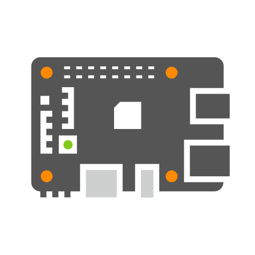

# Download live iso

## Archiso

Always updated, from the Italian server archmirror.it
 
[Download :fontawesome-regular-circle-down:](https://mirror.rackspace.com/archlinux/iso/latest/archlinux-x86_64.iso)

Signature verification

It is recommended to verify the signature of the image before use, especially if it was downloaded from an HTTP mirror, where downloads may be subject to interception to provide malicious images. On a system with GnuPG installed, run the following command to download the PGP ISO signature > in the directory with the ISO file, and verify it with:

`$ gpg --keyserver-options auto-key-retrieve --verify archlinux-version-x86_64.iso.sig`

Alternatively, from an existing Arch Linux installation run:

`$ pacman-key -v archlinux-version-x86_64.iso.sig`

    

## VM image

Official virtual machine images, the base image is designed for local use and is preconfigured with (user: arch - password: arch) and sshd running.

[Download :fontawesome-regular-circle-down:](https://gitlab.com/archlinux/arch-boxes)

    

## Docker

Official Docker image

`docker pull archlinux`

[Download :fontawesome-regular-circle-down:](https://hub.docker.com/_/archlinux)

    

## ARM

Arch Linux ARM is a Linux distribution for ARM computers

[Download :fontawesome-regular-circle-down:](https://archlinuxarm.org/about/downloads)

    
