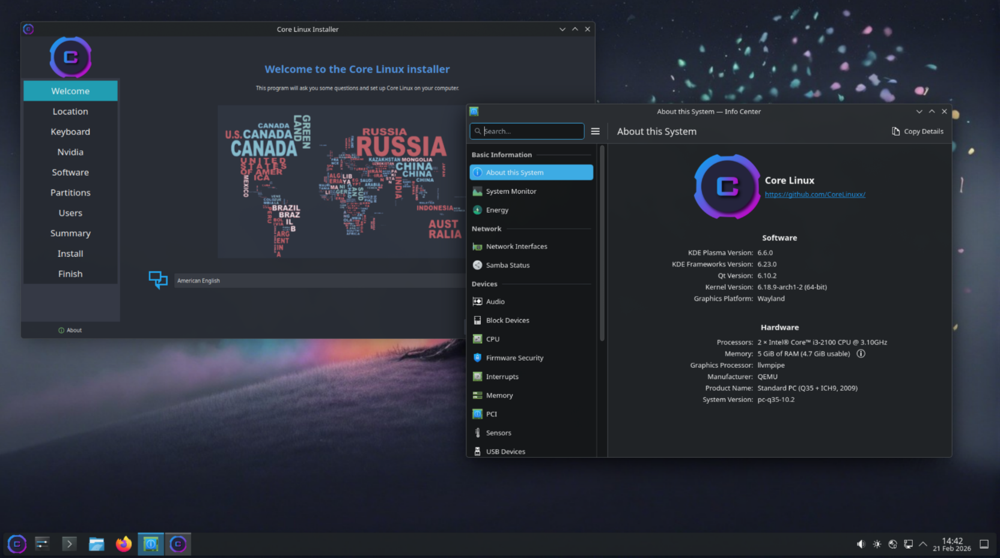

## ArchLatam Linux Community



Archlatam es una comunidad dedicada a la distribución Arch Linux y sus derivados. Esta comunidad está formada por entusiastas de Linux y la tecnología de código abierto que se reúnen para compartir información, recursos y conocimientos sobre Arch Linux y sus diversas modificaciones.

Los usuarios de Archlatam participan en foros, chatean en salas de chat o grupos sociales y comparten guías, programas y soluciones a problemas técnicos relacionados con Arch Linux y sus derivados. Archlatam ofrece una amplia gama de servicios, incluyendo una wiki, un foro y una colección de guías para instalar y configurar Arch Linux.

En estos recursos, los usuarios pueden encontrar información detallada sobre cómo usar esta distribución, así como consejos para personalizarla según sus necesidades. En resumen, Archlatam es una vibrante comunidad de entusiastas de Linux que unen fuerzas para apoyar y promover Arch Linux y sus numerosos derivados.

## Todos los canales oficiales

- [:fontawesome-solid-house-circle-check: Sitio oficial](https://archlatam.github.io/)
- [:fontawesome-brands-github: GitHub]()
- [:fontawesome-brands-discord: Discord](https://discord.gg/4eF5pGNgyz)
- [:fontawesome-solid-download: Descargar ISO](https://sourceforge.net/projects/archlatam/files/release202605/core-linux-202605.iso/download)

sha1sum ```3e6d2ccd7161d3fe1a1e0e8db2f6da23a7c10a7f core-linux-202605.iso```

<br>

## Equipo ArchLatam


- **Jose Dragic** - Founder
- **Joaquin (Pato) Decima** - Colaborador, site Admin - [:fontawesome-brands-github: GitHub](https://github.com/JoaquinDecima)
- **Faustino Echevarrieta** - Colaborador, site Admin - [:fontawesome-brands-github: GitHub]()

<br>

## Apoya a la comunidad

[](https://www.paypal.com/donate/?hosted_button_id=3C4YAF9NXMEWL)

Si eres un entusiasta de Arch Linux, apoya a nuestra comunidad en Archlatam y ayúdanos a crecer donando hoy. Con tu contribución, podemos garantizar la continuidad de nuestros servicios y ofrecer cada vez más apoyo y recursos a todos nuestros miembros. ¡Gracias por tu apoyo!

Support the Archlatam community of Arch Linux by making a donation to help us grow. If you're a passionate Arch Linux user, donate today and help us ensure the continuity of our services and provide even more support and resources to all of our members. Thank you for your support!

[Donaciones Paypal]()

<form action="https://www.paypal.com/donate" method="post" target="_top">
<input type="hidden" name="hosted_button_id" value="992A7JFKCFALJ" />
<input type="image" src="https://www.paypalobjects.com/en_US/i/btn/btn_donate_SM.gif" border="0" name="submit" title="PayPal - The safer, easier way to pay online!" alt="Donate with PayPal button" />

</form>

<br><br>
